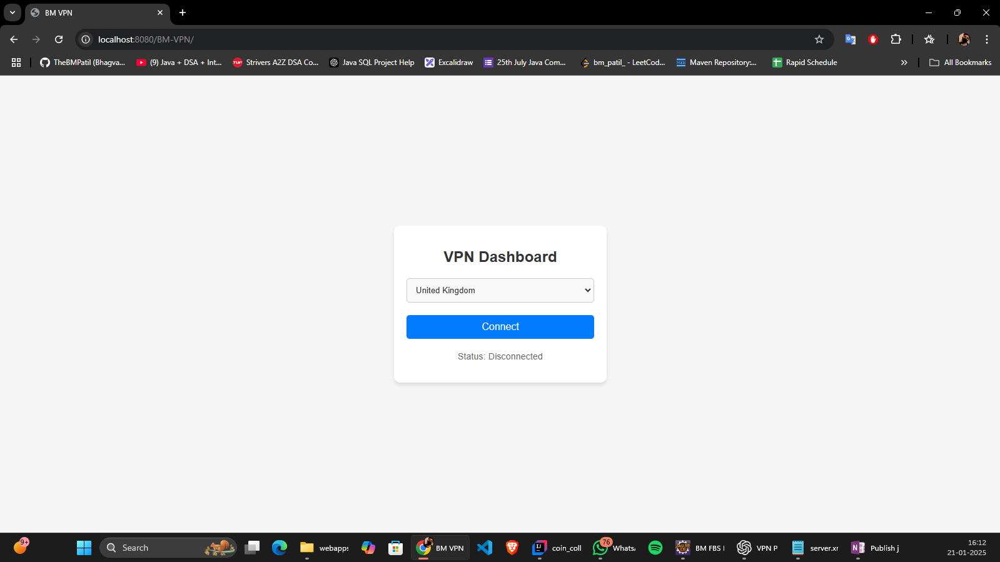

# VPN Project in Java

## 📋 Overview
This project implements a Virtual Private Network (VPN) using Java. The application provides secure communication over the internet by encrypting data and tunneling it through a client-server architecture. It is built to ensure confidentiality, integrity, and accessibility of transmitted data.

---

## ⚙️ Features
- **Secure Communication**: Data encryption and decryption using AES and RSA.
- **Client-Server Architecture**: Facilitates secure connections between multiple clients and the server.
- **Packet Tunneling**: Captures, encrypts, and redirects data securely.
- **User Authentication**: Basic authentication for clients connecting to the server.
- **Error Handling and Logging**: Ensures reliability and debuggability.


## 🛠️ Prerequisites
Before running the project, ensure the following are installed:
1. **Java Development Kit (JDK)** 17 or later
2. **Apache Tomcat** (for deployment)
3. **Git** (for version control)

Familiarity with:
- Networking basics (IP, TCP/UDP, Port Forwarding)
- Java Cryptography API
- Java Servlets and JSP
- JAX-WS for Web Services

---

## 📸 Screenshots
1. **Home Page**:  
   


---


## 🚀 Getting Started

### **1. Clone the Repository**
```
bash git clone https://github.com/TheBMPatil/simple-vpn-web-project-java
cd simple-vpn-web-project-java
```

### **2. Build the Project**
Use your IDE (Eclipse ) to build the project.  
Ensure all required libraries are added to the project classpath.

### **3. Deploy the Application**
1. Package the application into a WAR file.
2. Deploy it on a servlet container such as Apache Tomcat.

### **4. Access the Application**
- Open your browser and navigate to `http://localhost:8080/BM-VPN`.
- Use the provided login credentials to connect.

---

## 📂 Project Structure
```
BM-VPN/
├── src/
│   ├── main/
│   │   ├── java/
│   │   │   ├── com.bm.vpn.controller/
│   │   │   │   └── ConnectServlet.java        # Handles client-server communication
│   │   │   ├── com.bm.vpn.model/
│   │   │   │   └── Model.java                # Defines data models
│   │   │   ├── com.bm.vpn.service/
│   │   │       └── VPNService.java           # Core VPN logic (encryption, tunneling)
│   │   └── webapp/
│   │       ├── META-INF/                     # Metadata and deployment configurations
│   │       ├── scripts/                      # JavaScript files for frontend functionality
│   │       ├── style/                        # CSS stylesheets
│   │       ├── WEB-INF/
│   │       │   ├── web.xml                   # Deployment descriptor
│   │       └── index.html                    # Frontend entry point
├── build/                                    # Compiled classes
├── Libraries/                                # External libraries
└── README.md                                 # Project documentation
```


## 📧 Contact
For any queries or contributions, reach out to:  
**[Bhagvat Mutthe]** - [bhagvatnmutthe@gmail.com]  
GitHub: [TheBMPatil](https://github.com/TheBMPatil)


